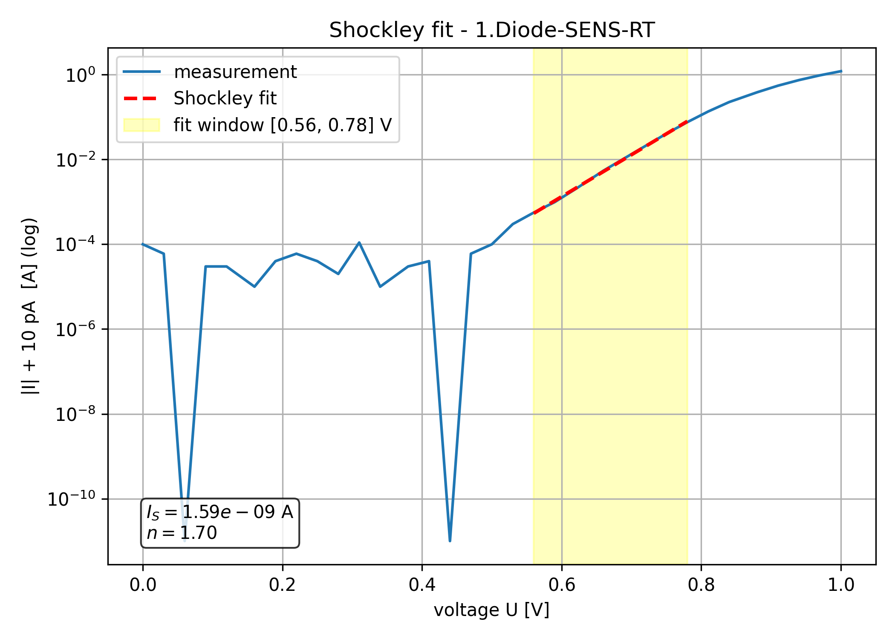
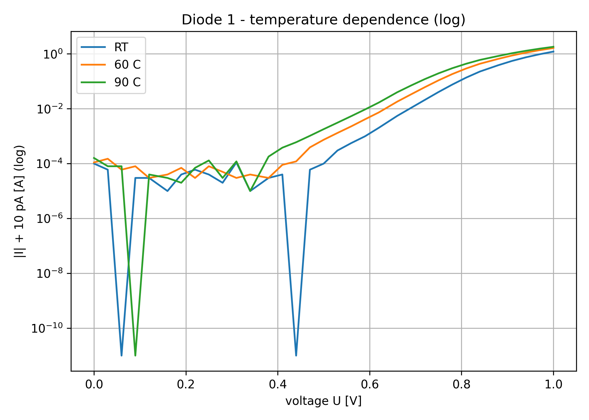

# Semiconductor Diode I–V Analysis

Measurement analysis of two silicon diodes from the *Halbleiterbauelemente* (semiconductor
devices) lab at TU Berlin. From measured current–voltage curves the code extracts the
physical device parameters — **saturation current $I_S$**, **ideality factor $n$** and
**forward voltage $U_f$** — and studies their **temperature dependence**.

The analysis is a reproducible Python pipeline: each figure in [`figures/`](figures) is
regenerated from the raw measurements in [`data/`](data) by the scripts in [`src/`](src).

## Physics background

In forward bias the diode follows the **Shockley equation**

$$I = I_S \left( e^{\,U / (n\,U_T)} - 1 \right), \qquad U_T = \frac{kT}{q}$$

so a straight line appears in a semi-log plot of $\ln I$ vs. $U$. Fitting that line gives:

- **slope** $a = \dfrac{q}{n\,kT} \;\Rightarrow\;$ ideality factor $n = \dfrac{1}{a\,U_T}$
- **intercept** $b \;\Rightarrow\;$ saturation current $I_S = e^{\,b}$

The fit window is selected automatically as the most linear region (highest $R^2$) of the
forward branch — see [`src/diode.py`](src/diode.py).

## Results

Shockley fit over both diodes at room temperature (RT), 60 °C and 90 °C:

| Measurement | T [K] | $I_S$ [A] | $n$ | $R^2$ | $U_f$ [V] |
|---|---:|---:|---:|---:|---:|
| Diode 1 — RT   | 300 | 1.59 × 10⁻⁹ | 1.70 | 0.9993 | 0.648 |
| Diode 1 — 60 °C | 333 | 2.59 × 10⁻⁸ | 1.71 | 0.9995 | 0.643 |
| Diode 1 — 90 °C | 363 | 1.09 × 10⁻⁷ | 1.65 | 0.9994 | 0.637 |
| Diode 2 — RT   | 300 | 2.06 × 10⁻⁹ | 1.74 | 0.9997 | 0.648 |
| Diode 2 — 60 °C | 333 | 3.00 × 10⁻⁸ | 1.72 | 0.9995 | 0.643 |
| Diode 2 — 90 °C | 363 | 1.58 × 10⁻⁷ | 1.69 | 0.9994 | 0.635 |

**Key observations**

- **$I_S$ rises steeply with temperature** — roughly two orders of magnitude from RT to 90 °C —
  consistent with its strong dependence on the intrinsic carrier concentration.
- **Ideality factor $n \approx 1.7$** for both diodes, between the ideal-diffusion ($n=1$) and
  recombination ($n=2$) limits, as expected for a real silicon diode.
- **Forward voltage $U_f$ drops slightly with temperature** (≈ 0.648 → 0.636 V), the familiar
  negative temperature coefficient of a silicon junction.
- Excellent fit quality ($R^2 > 0.999$) confirms the chosen Shockley region.

<p align="center">
  
  
</p>

## Repository structure

```
data/        raw I-V measurements (source-meter CSV export, 8 series)
src/
  diode.py            shared library: loading, Shockley fit, n & I_S
  shockley_fit.py     per-curve Shockley fit -> I_S, n, R^2 + plots
  compare_curves.py   SENSE on/off and temperature comparison plots
  tangent_uf.py       forward voltage U_f via tangent at 0.7 V
figures/     generated plots (shockley / temperature / sense-comparison / tangents)
```

The `figures/differential-resistance/` plots come from a separate part of the lab and are
kept as results only.

## Reproduce

```bash
python3 -m venv .venv && source .venv/bin/activate
pip install -r requirements.txt

cd src
python shockley_fit.py     # prints the results table and writes Shockley plots
python compare_curves.py   # SENSE and temperature comparison plots
python tangent_uf.py       # forward-voltage tangents
```

## Measurement notes

- Two silicon diodes, swept in forward bias with a source-measure unit; the export uses a
  `';'`-quoted CSV format that `src/diode.py` parses directly.
- **SENSE** series use 4-wire (Kelvin) sensing to remove lead-resistance error; the
  `sense-comparison` plots show its effect against the 2-wire measurement.
- Temperatures RT / 60 °C / 90 °C are nominal junction temperatures used for $U_T$.
