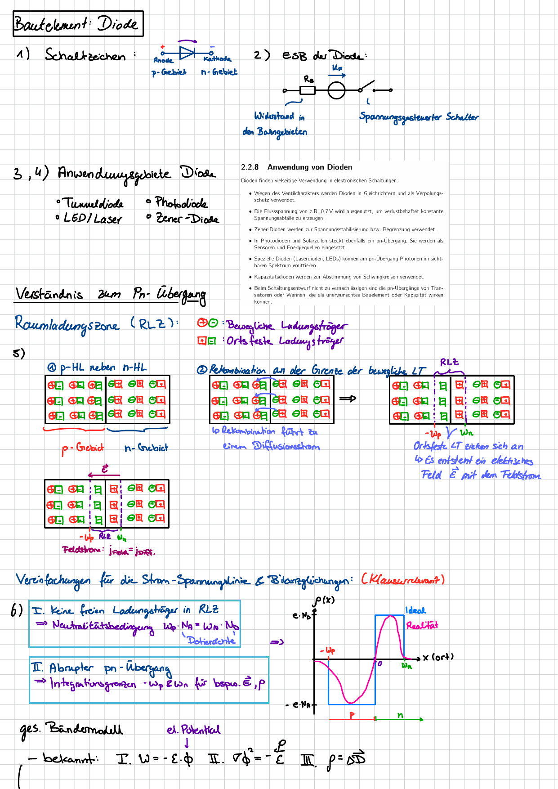
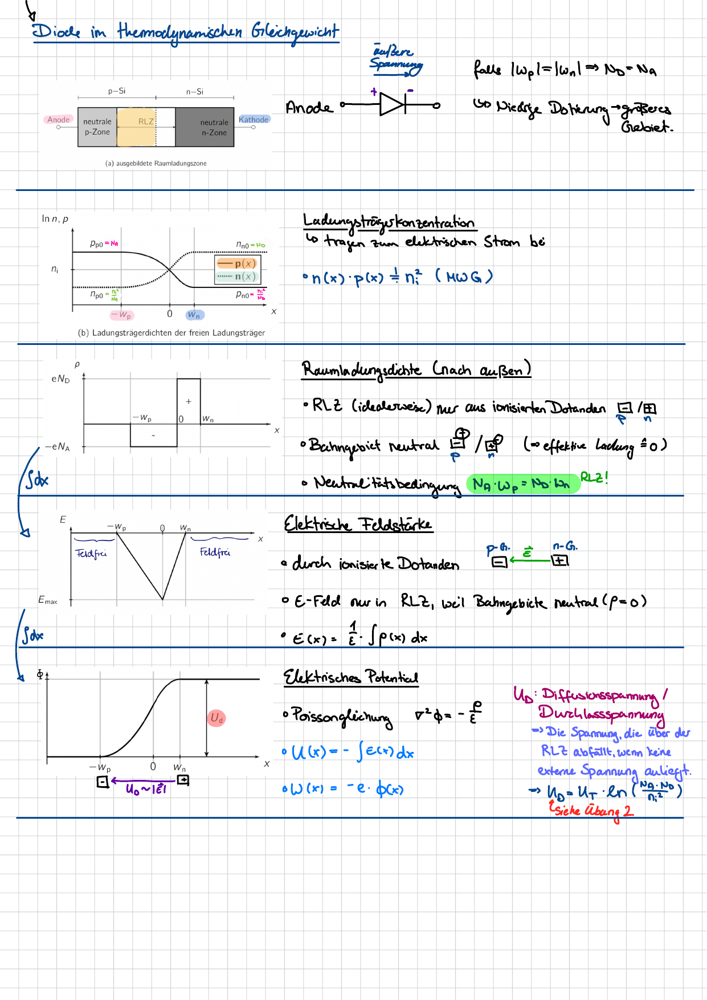
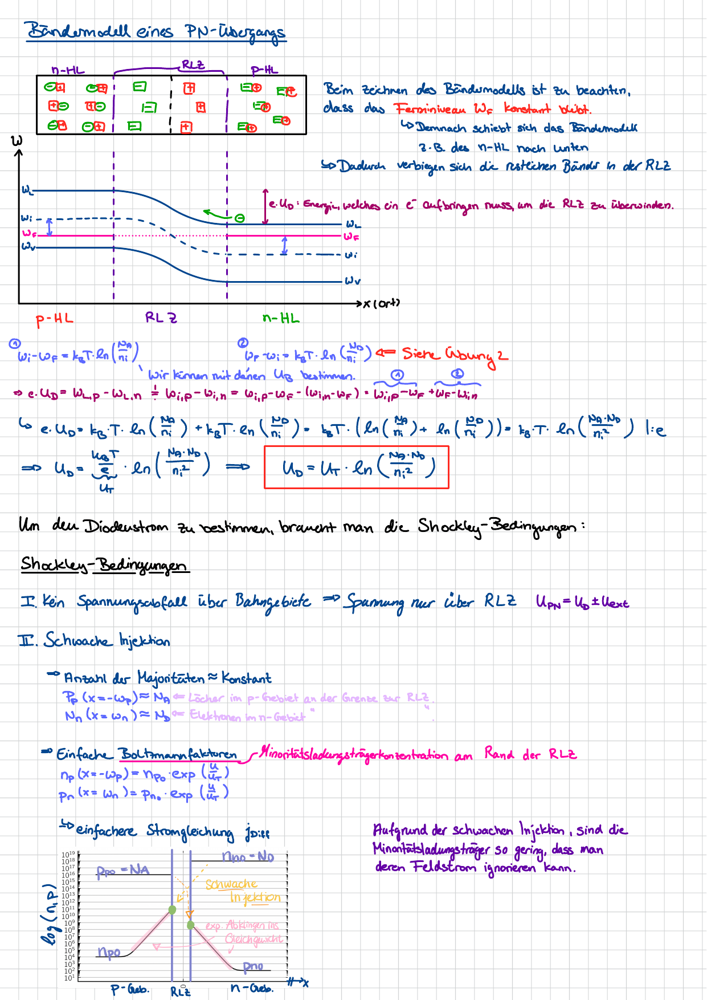
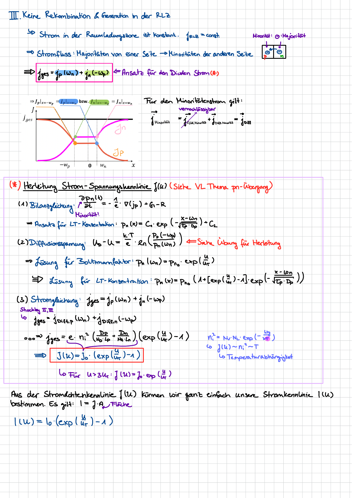
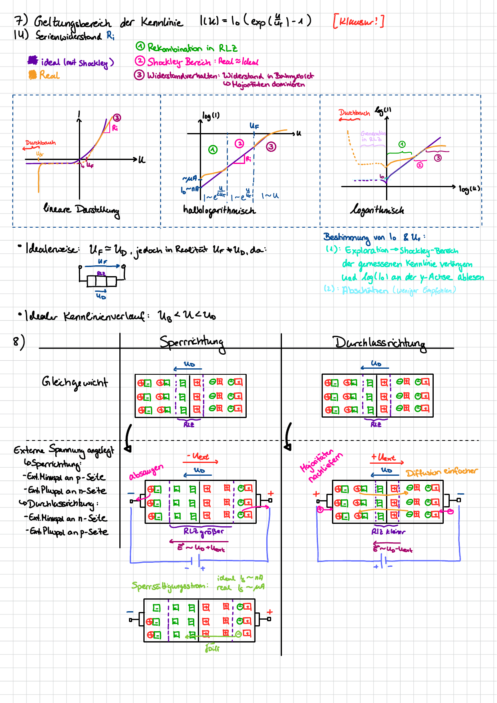
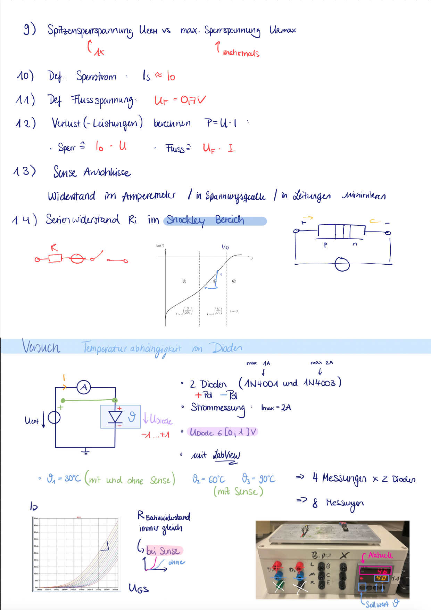

# Theory & Measurement Background

Background notes for the diode I–V analysis: the physics of the pn-junction, the
derivation of the Shockley characteristic, the operating regions used in the fit, and
the measurement setup that produced the data in [`../data`](../data).

> **Source / credit:** These are handwritten preparation notes by **Aatir**, created
> together during the lab and reproduced here **with his permission**. All credit for the
> notes goes to him.

## 1. Diode basics — symbol, equivalent circuit, space-charge region

## 2. Diode in thermodynamic equilibrium

Carrier concentrations, space-charge density, electric field and potential across the junction.

## 3. Band model & Shockley conditions

Band diagram of the pn-junction and the Shockley assumptions, leading to the diffusion
voltage $U_D = U_T \ln\!\left(\frac{N_A N_D}{n_i^2}\right)$.

## 4. Derivation of the I–V characteristic

From the balance equation to the Shockley equation
$I(U) = I_S\left(e^{\,U/U_T} - 1\right)$, including the temperature dependence
$I_S \propto n_i^2$.

## 5. Operating regions & series resistance

Validity range of the characteristic in linear / semi-log / log representation — the
**Shockley region** is exactly the window fitted in
[`../src/shockley_fit.py`](../src/shockley_fit.py) — plus the series resistance $R_i$ and
the forward voltage $U_f$.

## 6. Measurement setup

Two silicon diodes (1N4001 / 1N4003) swept in forward bias, $I_{max} = 2\,\text{A}$,
$U_\text{diode} \in [0, 1]\,\text{V}$, recorded with LabVIEW. Four sweeps per diode —
30 °C (with/without SENSE), 60 °C and 90 °C (with SENSE) — i.e. **8 measurements** total,
the raw curves in [`../data`](../data).

